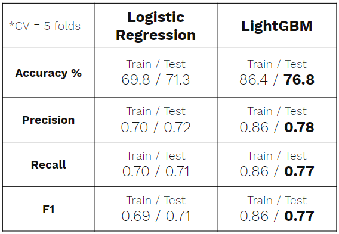
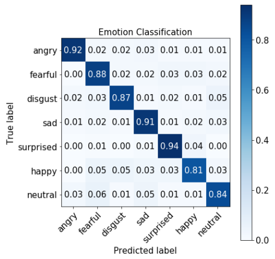

# Emotion Classifier Using Voice Audios
I built a tree based classifier LightGBM to classify a person's emotion based on his/her actual voice. I used LightGBM instead of neural network architecture such as CNN with RNN or LSTM since non-NN models are generally quicker than NN at training and predicting, and are more fit for implementation in real world applications. However, a lot of manual feature engineering was necessary to achieve meaningful results since non-NN models don't have automatic feature engineering from filters in CNN architecture.

## Project Intro/Objective
Purpose of this project is to take a first step to making a model that can classify human's emotion from voice in real time.  
Application of this model is broad : Automated customer service, dynamic marketing & advertising, law enforcement, animating characters in virtual world, NLP, and so on.  
Refer to this [Presentation Link](https://docs.google.com/presentation/d/1UL2GDdKJL_R4PZBUNNcc3zkf9M_hv5ENqw80CRg7Dxc/edit?usp=sharing) for a more comprehensive introduction.

## Datasets Used
* RAVDESS : [Download the Data](https://zenodo.org/record/1188976#.XVDlOi2ZO3V)
* TESS : [Scrape the Data](https://github.com/silvernine209/voice_emotion_classifier/blob/master/download_tess_dataset_scraper.ipynb)

## Methods Used
* Audio Signal Processing
* Feature Engineering
* LightGBM Classifier
* Data Visualization
* Flask App for Production Deployment : [Demo Link - YouTube](https://youtu.be/6blqy-s0VpM)

## Notable Technologies Used
* Python 3, Jupyter Notebook
* Pandas, Numpy, Matplotlib, Seaborn # Data Processing/Visualization tools
* LightGBM, Scikit-learn # Models
* RandomizedSearchCV # Automatic hyperparameter tuning & Cross validation
* Librosa # Audio signal processing
* etc. 

## Feature Engineering
Overall, I had very clean and fairly balanced dataset between 8 different emotions. After evaluating most of files for each emotion, I determined emotions "neutral" and "calm" could be combined into one emotion since they were very similar. It also improved class imbalance. Below is a quick look at my data.

* **Truncating Silences**- Get rid of useless data
* **Auto Correlation** - Attempt to remove noise and find fundamental frequency
* **Pitch Tracking** - Used root mean square of energy to find strong timbres of voice to find true fundamental frequencies.
* **Mel-frequency cepstral coefficients** - Similar to fingerprints of audio files. Best if used in moderation in order to generalize.
* **Percentiles** - Took different percentile values of time-domain signals so that it's time insensitive. Losing info, but helps to generalize.

## Model 
Logistic regression was used as baseline model for this multi-class classification project. For the final model, LightGBM with RandomizedSearchCV was used for hyperparameter tuning and cross validation with 5 folds on the training data. While lacking in explainability compared to the logistic regression, LightGBM is preffered for its better scores as shown below.  

## Result 
Below is confusion matrix generated from LightGBM model. It performed very well on the test dataset as already shown in the various scores from the Model section. Although very surprising, I contribute this too-good-to-be true results to my dataset. First of all, all audio files in the dataset were recorded with minimal noises. Secondly, very similar sentences repeated in the dataset, which was not optimal.  

## Conclusion
Overall, I was very happy that I was able to build a classifier that would classify different emotions using raw audio files (.wav) without using neural network as base. I pitched my model(LightGBM) as lighter and quicker, but true comparison has to be made in terms of time and performance since quicker execution time might not be able to justify significant performance boost you could potentially get with NN-based architecture. However, with the current model, I'm pretty confident in its ability to generalize due to the pre-processing and feature engineering performed. Furthermore, with more robust and diverse data, LightGBM model will be able to generalize even better.

Again, here is a demo of a working flask app : [Demo Link - YouTube](https://youtu.be/6blqy-s0VpM)

## [Link to Blog](https://silvernine209.github.io/matthewlee.github.io/)
